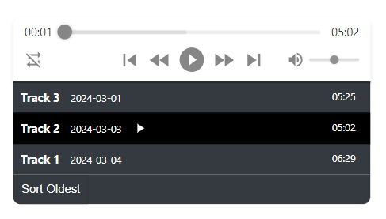

### Screenshot

This is for ReactJS and shouldn't depend on any outside style libraries.

Call the component by adding:  `import Player from './Player';`

In return, add:  
`<Player showPlaylistWindow={true} />`
